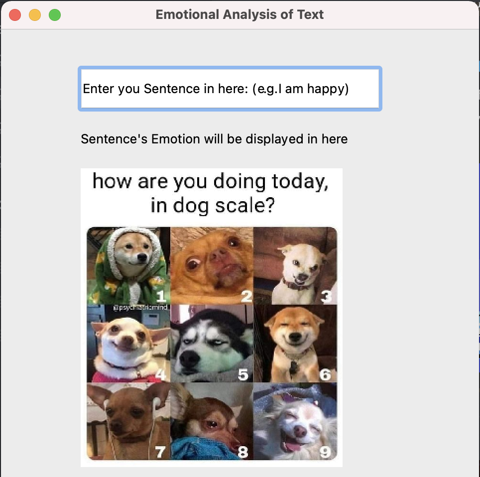
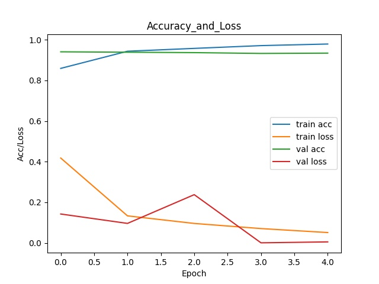
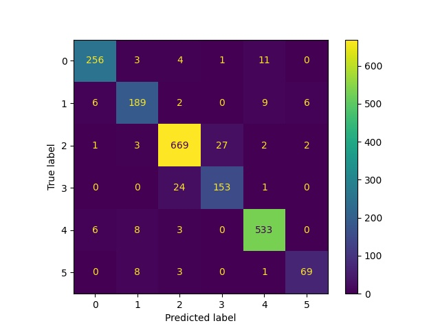

## Pytorch - NLP Repo
## Emotion Prediction with Sentence using Bert with Classification Layer
This repo is field tested on Ubuntu 16.04, RTX 3070 GPU

Demo Video:
https://youtu.be/eORfhaLjZts
    
  

## 1. Requirement of Environment 
Please create a virtual environment via conda or other method

Command:
    conda create -n NLP python=3.7
    conda activate NLP
    
For those who are just wanting to 
- try the demo (gui.py)
- run the test dataset (test.py)
- run the single input inference function (inference.py)

Install the envirnoment with requirements file with no CUDA support

Command:

    pip install -r requirements.txt
    
For those who are interested in training, delete the "torch" in requiremnts file
Follow the instruction of installing torch CUDA support on  https://pytorch.org/get-started/locally/

Command Example: 

    conda install pytorch torchvision torchaudio cudatoolkit=10.2 -c pytorch

## 2. File Structure
    L archive
    L config
    L data
    L graphical_interface
    L test
    L trainer
      L model  #For saving trained model
      L tokenizer # For saving tokenizer
    L utils 
    
## 3. Training (Requires CUDA)

The training takes the dataset inside the data file and runs with a Bert Classifier on Adam optimzer for 5 epoches. 
To configure the learning rate ,  optimizer hyperparameter or the epoches, please edit ./config/config.py 

Lists of HyperParam in config.py :

      learning_rate = 2e-5
      adam_epsilon = 1e-8
      num_of_epoch = 1
      num_labels = 6

To start training: 

Command: 

      python trainer/train.py
    
Log: 

      Handling dataset:  train
      Handling dataset:  val
      Epoch Number:  1
      [ train dataset]
      Progress: [------------------> ] 99 %(dataset_type) acc: 0.8594375, loss: 0.41807940747216343
      [ val dataset]
      Progress: [------------------> ] 99 %(dataset_type) acc: 0.941, loss: 0.14256180822849274
      ...
 
After running the command , the 
- model --> saved in ./trainer/model
- tokenizer --> saved in ./trainer/tokenizer
- results and other metrics --> saved in ./trainer

Result showcase

- Accuracy and Loss / Confusion Matrix 
 

- Confusion Matrix 

## 4. Testing
The test.py takes the test data in ./data folder and runs with the trained model.
The result will be saved in ./test folder as test_prediction.txt

This command requires trained model and tokenizer, if the model and tokenizer folder are empty, please download them in here : https://drive.google.com/drive/folders/1JZv_7skWp4OMUQGsfu1idlz7suWhRR-N?usp=sharing

Command:

      python test/test.py

Result showcase:

      sadness
      sadness
      sadness
      joy

## 5. Demo with Graphical User Interface
The gui.py takes the input via the text editing box and runs with the trained model.

This command requires trained model and tokenizer, if the model and tokenizer folder are empty, please download them in here : https://drive.google.com/drive/folders/1JZv_7skWp4OMUQGsfu1idlz7suWhRR-N?usp=sharing

Command: 

      python graphical_interface/gui.py
      
  

